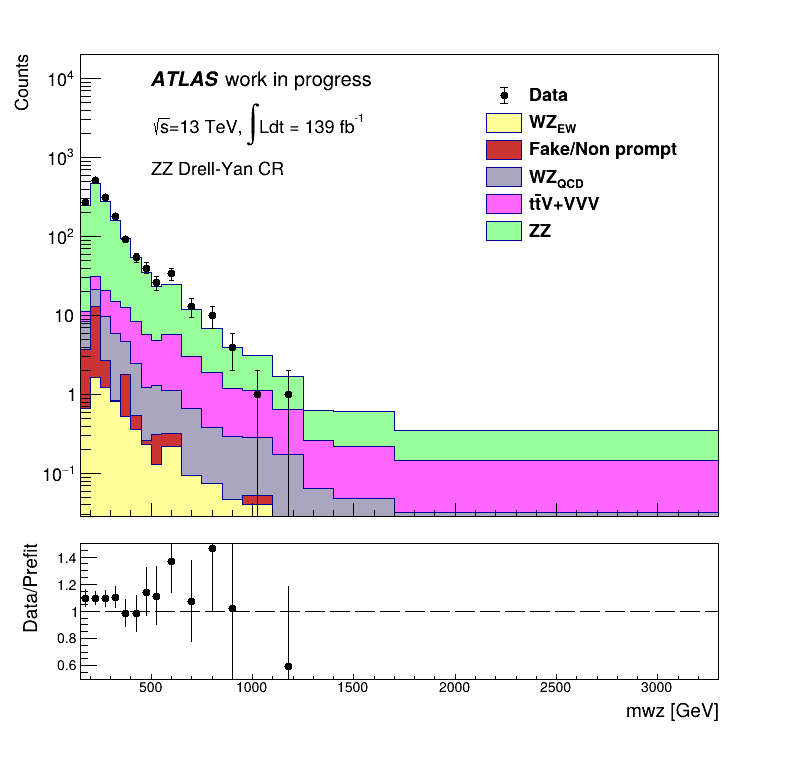
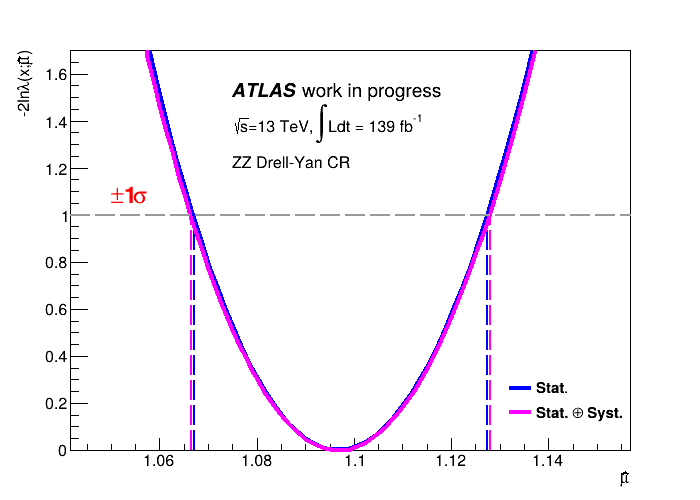

# Maximum Likelihood Estimation Analysis in Particle Physics Data

## Overview 

This project demonstrates advanced parameter estimation techniques using Maximum Likelihood Fits implemented in **C++17** with the **ROOT Data Analysis Framework**. It focuses on estimating key parameters and quantifying their uncertainties, incorporating both statistical and systematic effects through Profile Likelihood Ratio methods. 

While originally applied to particle physics data, the techniques showcased here are relevant to industry problems involving statistical modeling, uncertainty estimation, and complex data analysis challenges.

## Skills Demonstrated

- **Statistical Modeling**: MLE with uncertainty quantification via profile likelihoods
- **Data Analysis**: Handling and interpreting complex, real-world datasets
- **Software Engineering**: Modular, reproducible C++17 code with Makefiles and JSON config
- **Visualization**: Clear presentation of statistical results and confidence intervals
- **Scientific Communication**: Well-documented, thesis-supported technical analysis

## Features

- **Maximum Likelihood Estimation (MLE):** Implements parameter estimation using ROOT's `TMinuit` minimizer for robust statistical inference.
- **Profile Likelihood Ratio:** Quantifies the impact of nuisance parameters on signal strength estimation, improving model reliability.
- **Uncertainty Quantification:** Fits likelihood curves with quadratic functions to extract parameter uncertainties and confidence intervals.
- **Customizable Analysis Regions:** Supports multiple physics control regions (`ZZ`, `WZ_qcd`), allowing flexible application of the model.
- **Visualization:** Generates publication-quality plots including likelihood ratio curves, profile likelihood comparisons, and annotated confidence intervals.
- **Interactive Workflow:** User inputs guide the analysis, facilitating exploration of different variables and regions.
- **Integration with JSON Configuration:** Uses JSON files to configure input parameters and file paths, enhancing reproducibility and ease of use.

## Technologies Used

- C++17  
- [ROOT](https://root.cern/) (data analysis framework)  
- [JSON for Modern C++](https://github.com/nlohmann/json) (config parsing)
- [Docker Desktop](https://www.docker.com/products/docker-desktop/)

## Usage 

In order for the user to be able to run the project on their local machine without needing to install the ROOT framework package, a Dockerfile is included. 

To build the project in a container using the docker file, the following command is needed:

```bash
docker build -t likelihood_fit .
```

To run using interactive input, taking into account the JSON file, the input files that are needed for the project to run and have the ouput pasted on the local directory, this command is used:

```bash
docker run -it -v "$(pwd)/input.json:/app/input.json" -v "$(pwd)/data:/app/data" likelihood_fit
```

The user should follow the interactive prompts to choose a variable and a region. The project is asking the user if they want to print the results as png files, with their names being print after the interactive prompt. If the user wants to see the images, they should first find the name of the container generated:

```bash
docker ps -a
```

Then, having retrieved the name of the container, the can copy the png image on their local repository using this command:

```bash
docker cp container_name:/app/name_of_the_image.png .
```

Finally, they can delete the container with following command:

```bash
docker rm container_name
```

## Output Plots

Below one can see some examples of the plots that are generated with this project.

This is an example of Data and Simulations stacked together in the `ZZ` region:



This is an example of the Likelihood Ratio and Profile Likelihood Ratio estimation plotted together to emphasize the fact that the systematic uncertainty increases the total uncertainty of the estimation:



More examples of the plots generated using this project can be found in the **output** folder of this repository.

## Further Reading

For a detailed explanation of the statistical methods and physics context, please refer to my thesis, included in the **docs** folder of this repository.

## License

This project is licensed under the [MIT License](LICENSE).

## Contact

In case you need further clarification or you are interested in collaborating, feel free to reach out at **panagiotis.ziakas@cern.ch**.
